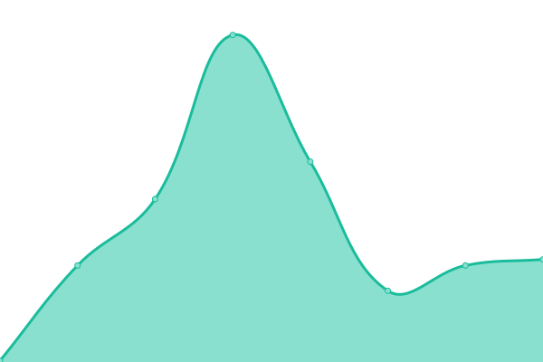
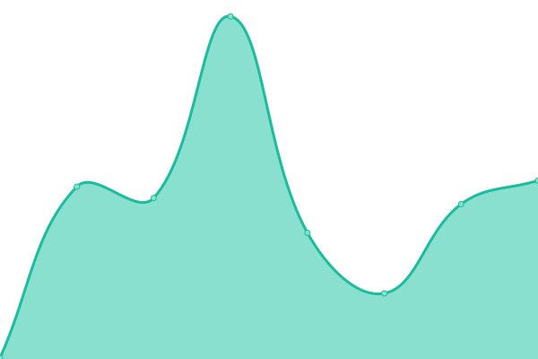

# [📈 Live Status](https://status.nilead.com): <!--live status--> **🟥 Complete outage**

This repository contains the open-source uptime monitor and status page for [Nilead](https://status.nilead.com), powered by [Upptime](https://github.com/upptime/upptime).

With [Upptime](https://upptime.js.org), you can get your own unlimited and free uptime monitor and status page, powered entirely by a GitHub repository. We use [Issues](https://github.com/Nilead/uptime/issues) as incident reports, [Actions](https://github.com/Nilead/uptime/actions) as uptime monitors, and [Pages](https://status.nilead.com) for the status page.

<!--start: status pages-->
<!-- This summary is generated by Upptime (https://github.com/upptime/upptime) -->
<!-- Do not edit this manually, your changes will be overwritten -->
<!-- prettier-ignore -->
| URL | Status | History | Response Time | Uptime |
| --- | ------ | ------- | ------------- | ------ |
|  [Nilead Website](https://nilead.com) | 🟥 Down | [nilead-website.yml](https://github.com/Nilead/uptime/commits/HEAD/history/nilead-website.yml) | 

 166ms
     
 | 

<a href="https://status.nilead.com/history/nilead-website">0.00%</a>
    

|  [Nilead Logger](https://logger.mynilead.com:9502/status) | 🟥 Down | [nilead-logger.yml](https://github.com/Nilead/uptime/commits/HEAD/history/nilead-logger.yml) | 

 0ms
     
 | 

<a href="https://status.nilead.com/history/nilead-logger">0.00%</a>
    

|  [Nilead Tracker](https://tracker.mynilead.com:9501/status) | 🟥 Down | [nilead-tracker.yml](https://github.com/Nilead/uptime/commits/HEAD/history/nilead-tracker.yml) | 

 0ms
     
 | 

<a href="https://status.nilead.com/history/nilead-tracker">0.00%</a>
    

|  [Nilead Monitor](https://monitor.mynilead.com:9503/status) | 🟥 Down | [nilead-monitor.yml](https://github.com/Nilead/uptime/commits/HEAD/history/nilead-monitor.yml) | 

 0ms
     
 | 

<a href="https://status.nilead.com/history/nilead-monitor">0.00%</a>
    

<!--end: status pages-->

[**Visit our status website →**](https://status.nilead.com)

## 📄 License

- Powered by: [Upptime](https://github.com/upptime/upptime)
- Code: [MIT](./LICENSE) © [Nilead](https://status.nilead.com)
- Data in the `./history` directory: [Open Database License](https://opendatacommons.org/licenses/odbl/1-0/)
